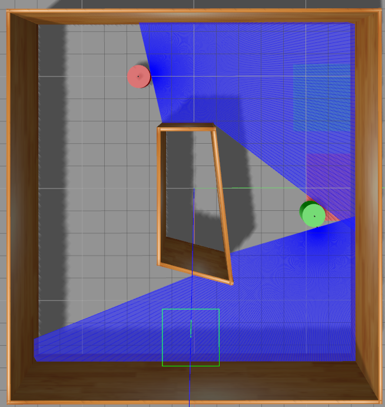

# multiDAgger
Learning to navigate in five minutes

## Overview
A brief implementation of DAgger in multi-agent environment. It Only takes five minutes to learn a basic policy from human-beings.
### Inputs:
- Forward looking single line lidar
- Relative target pose

### Output:
 - [Acc, Dec, Left_turn_slightly, Right_turn_slightly]
 
## Setup
### Dependencies
 - rospy
 - gazebo
 - Pytorch

### Commands
Start the simulation environment:
```
roscore
rosrun gazebo_ros gazebo multiDAgger.world
```
Use the turtlesim teleop_key as remote controller:
```
rosrun turtlesim turtle_teleop_key
```
Start main loop (for training):
 
```
python referee.py
```
Start main loop (just for policy test):
```
python test_referee.py
```

## Demo
The green robot is controlled by DAgger framework(human and network), the red robot is controlled only by network.

